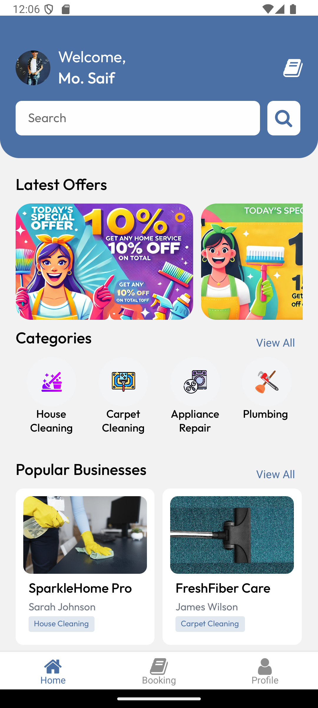
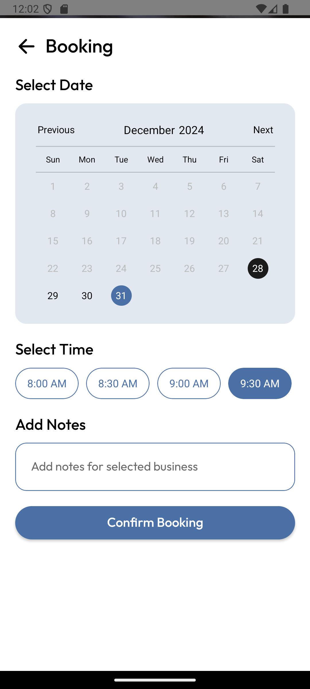
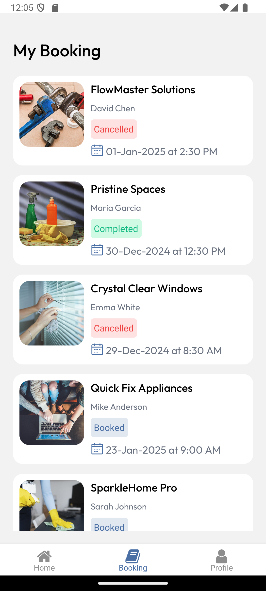

# HomeEase - Professional Cleaning & Repair Services App

HomeEase Pro connects users with verified professional cleaning and repair service providers in their area. The app streamlines the process of finding, booking, and managing home maintenance services.

## App Preview

<div style="display: flex; justify-content: space-between;">
    
    
    
    
</div>

## Tech Stack

### Core Technologies

- [React Native](https://reactnative.dev/) - Core framework
- [Expo](https://expo.dev/) - Development platform
- [Clerk](https://clerk.dev/) - Authentication & user management
- [GraphQL](https://graphql.org/) - API architecture
- [React Navigation](https://reactnavigation.org/) - Navigation system

## Getting Started

1. **Clone the repository**

```bash
git clone https://github.com/MoSaif00/Home-Ease.git
cd home-ease
```

2. **Install dependencies**

```bash
npm install
```

3. **Configure environment variables**

```bash
cp .env.example .env
```

Update the following variables in `.env`:

- `EXPO_PUBLIC_CLERK_PUBLISHABLE_KEY`
- `EXPO_PUBLIC_HYGRAPH_KEY`

4. **Start the development server**

```bash
npx expo start
or
npm run start
```
